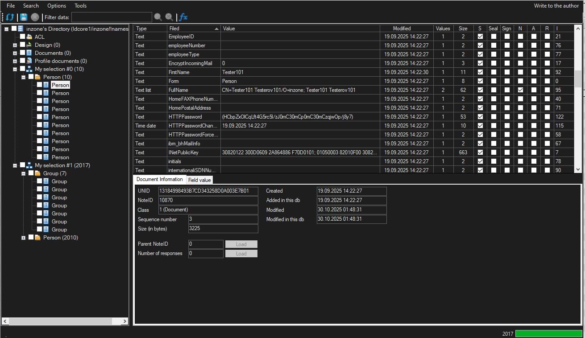
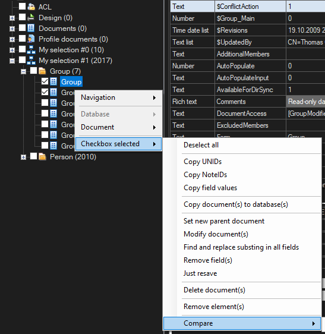
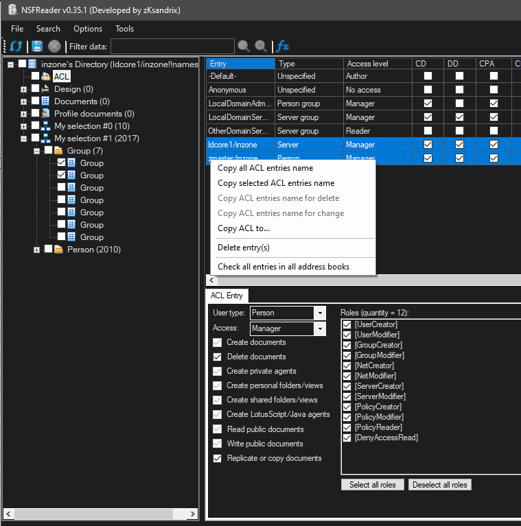
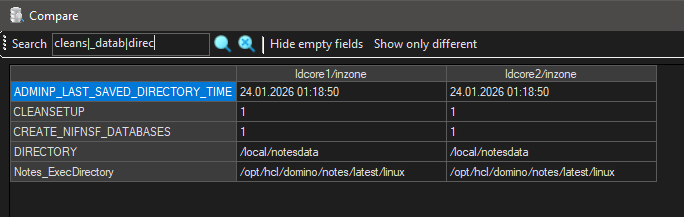
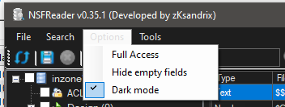

<h1>NSFReader</h1>

A new alternative to ScanEZ (Ytria) for HCL Notes. ****Works only with HCL Notes x64.***\
\
ScanEZ is a heavyweight solution with licensing. Without a license, only document reading is available.\
NSFReader is a simple, lightweight application created by an administrator for administrators. The main concept is convenience and speed!\
The application is in active development, but already has the basic features needed by administrators.\
****Currently, the application is not licensed and is freely available!***
## Installation
* Create the NSFReader.nsf database from the NSFReader.ntf template (ODS 55).
* Open the created NSFReader.nsf database and click the “Install NSFReader” button (lower left corner).
* In the security settings, set the flag: "Don't prompt for a password form other Notes-based programs".
* Restart the HCL Notes client.

After that, a new “NSFReader” panel will appear. There are only 2 buttons in this panel:
1. To open a single document.
2. To open all selected documents.

Contact information:\
&nbsp;&nbsp;&nbsp;&nbsp;zksandrix@gmail.com\
&nbsp;&nbsp;&nbsp;&nbsp;zmaster@inzone.pro
## UI
**Simple, uncluttered program interface:** 

  
**A wide range of document management options:** 

  
**A wide range of options for working with multiple documents simultaneously:** 

  
**Ability to work with ACLs:** 

  
**Ability to view database information, including changing ReplicaID, In/Out of service, On/Off replica, Clear replica history:** 

  
**Ability to compare documents, server statistics, or notes.ini parameters:** 

  
**Ability to work in Full admin mode, enable dark mode and hide empty document fields:** 
